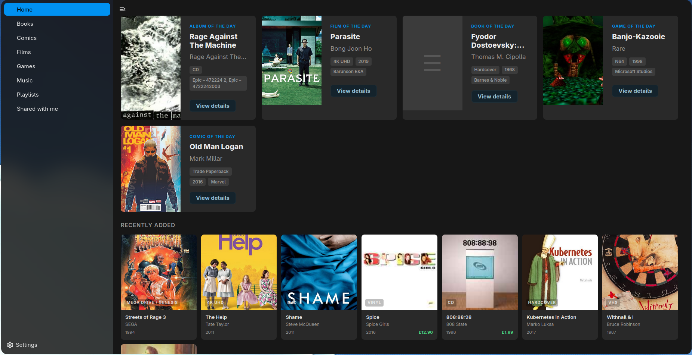
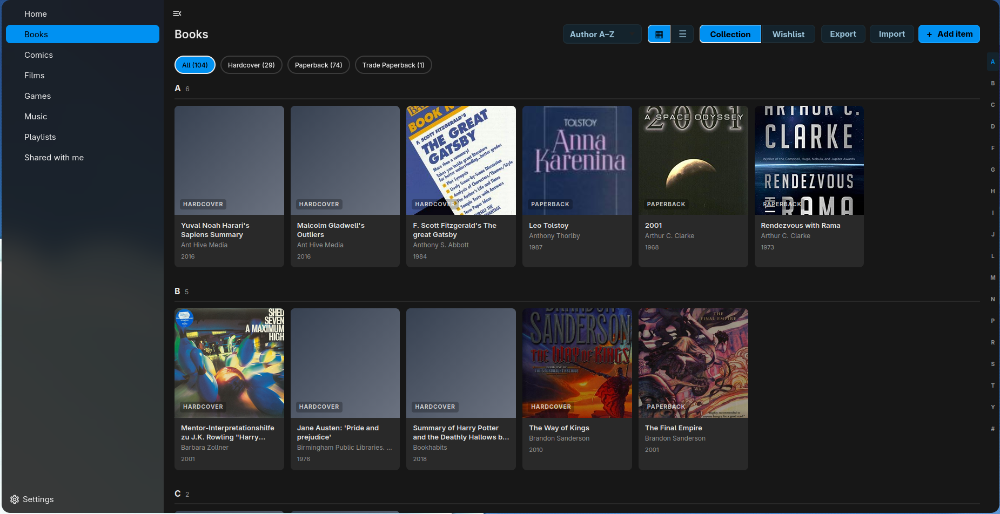
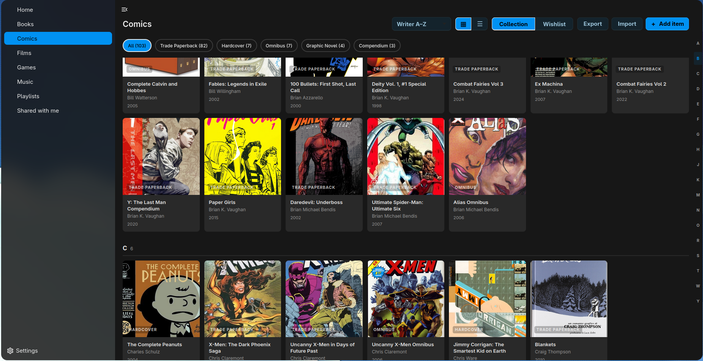
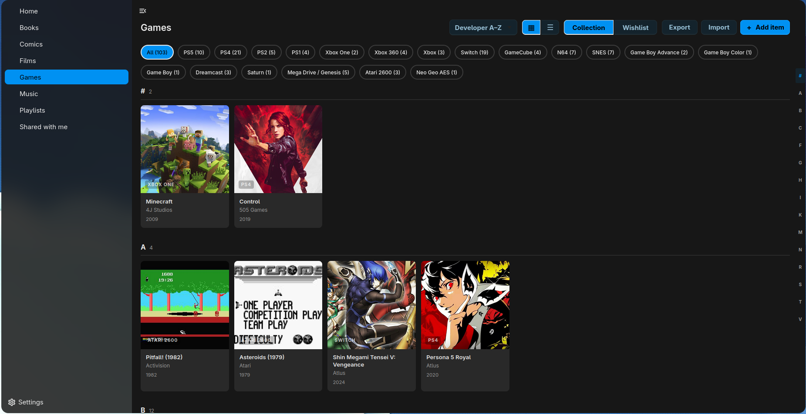
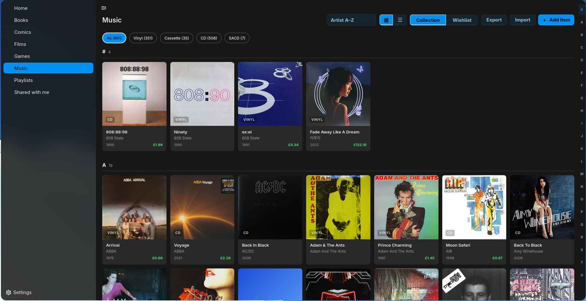
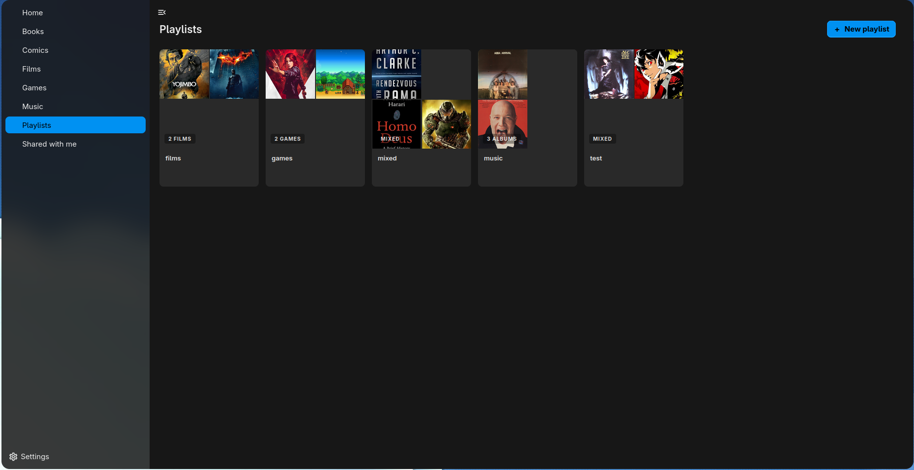
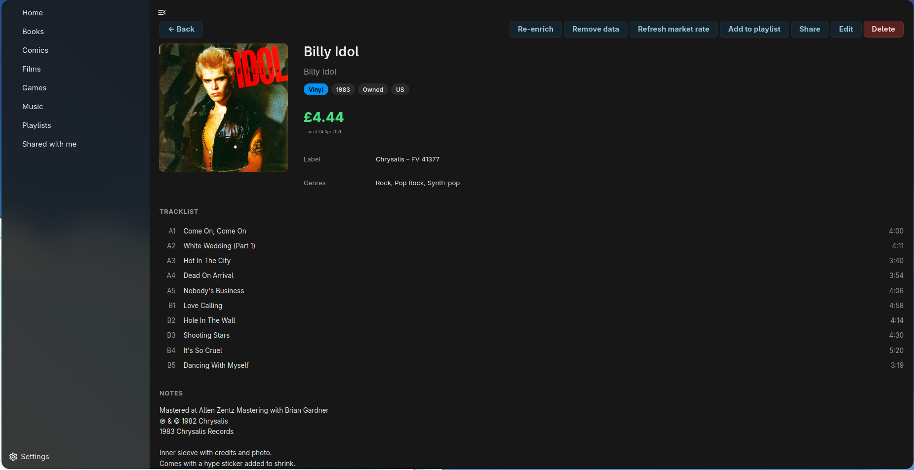
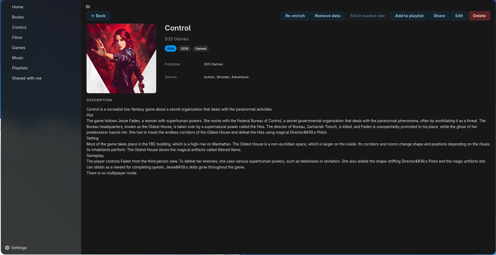
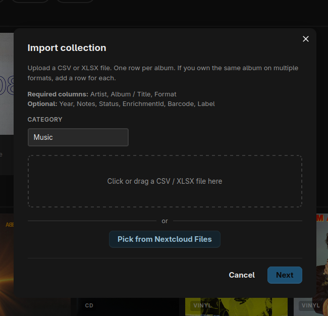

Forked v0.5.3 from megamaced/crate:
 - Added Nextcloud 34 support
 - Made catalogue globally available, instead of private
 - Made API keys fallback to 
 - Added JS bundle

The fallback api's are coded to my local username (geekhat), on #37 of lib/Controller/SettingsController.php - I'll look into a fix for this in a future update, but for now just replace 'geekhat' with the username who originally entered the API's.
-----
# Crate

A personal physical media cataloguing app for [Nextcloud](https://nextcloud.com). Track your music, films, books, games and comics — what you own, what you want, and what they're worth — on a server you control.

> **100 % AI-written.** Every line of source, every test, every CI workflow, this README, and almost every commit message in this repository was written by [Claude Code](https://www.anthropic.com/claude-code) under direction from a human reviewer. No code in this repository was hand-typed.



## Screenshots

### Collection views

| Books | Comics | Films |
| --- | --- | --- |
|  |  |  |

| Games | Music | Playlists |
| --- | --- | --- |
|  |  |  |

### Detail views & import

Rich, category-aware detail with auto-fetched metadata, tracklists, market values, and per-item actions (re-enrich, refresh market rate, share, edit, add to playlist). Bulk-add an existing collection by uploading a CSV or XLSX.

| Music detail | Game detail | Import |
| --- | --- | --- |
|  |  |  |

## Features

- **Five categories** — Music, Films, Books, Games, Comics — each with category-appropriate fields, search providers, and detail views
- **Add by barcode** for music (Discogs) and books (Open Library), or by external search for films (TMDB), games (RAWG) and comics (ComicVine)
- **Auto-enrichment** pulls full metadata, artwork, tracklists, artist bios and pressing notes
- **Market values** for music (Discogs price suggestions) and games / comics (PriceCharting), with multi-currency support
- **Wishlist** alongside your owned collection
- **Playlists** — mixed-category groups of items
- **Sharing** with other users on the same Nextcloud instance
- **CSV / XLSX export**
- A native [**Android companion app**](https://github.com/megamaced/crate-android)

## Requirements

- Nextcloud 29 – 33

## Optional API tokens

You provide your own — they live encrypted in your Nextcloud credential store and never leave your server. Crate works without them but enrichment is more limited.

- **Discogs** — music metadata + market values ([free PAT](https://www.discogs.com/settings/developers))
- **TMDB** — film metadata ([free API token](https://www.themoviedb.org/settings/api))
- **RAWG** — game metadata ([free API key](https://rawg.io/apidocs))
- **ComicVine** — comic metadata ([free API key](https://comicvine.gamespot.com/api/))
- **PriceCharting** — game / comic market values

Open Library (book metadata) needs no token.

## Installation

This app is not yet on the Nextcloud App Store. To install (or upgrade) from a release archive, run the following from your `custom_apps` directory:

```bash
# 1. Back up the existing install (in case rollback needed; skip on first install)
mv crate crate.bak.$(date +%s)

# 2. Download & extract the release
CRATE_VERSION=0.4.6
curl -sSL -o crate-${CRATE_VERSION}.tar.gz \
  https://github.com/megamaced/crate/releases/download/v${CRATE_VERSION}/crate-${CRATE_VERSION}.tar.gz
tar -xzf crate-${CRATE_VERSION}.tar.gz
rm crate-${CRATE_VERSION}.tar.gz

# 3. Fix ownership (Nextcloud usually runs as www-data; check with `ls -l` first)
chown -R www-data:www-data crate

# 4. From the Nextcloud root, run upgrade so any migrations apply
su -c "php /var/www/html/occ app:disable crate" -s /bin/bash www-data
su -c "php /var/www/html/occ app:enable crate" -s /bin/bash www-data
su -c "php /var/www/html/occ upgrade" -s /bin/bash www-data
```

Or, for development, clone this repo into `custom_apps/crate` and run `npm ci && npm run build` to compile the JS bundle.

## Building

```bash
composer install
npm ci
npm run build
```

Tests:

```bash
vendor/bin/phpcs --standard=PSR12 lib/
vendor/bin/phpunit --testsuite unit
npm run lint
```

## Releases

Tagged `v*` pushes produce a release archive (`crate-<version>.tar.gz`) ready to drop into a Nextcloud `custom_apps/` directory. Built and attached automatically by GitHub Actions.

## License

[AGPL-3.0-or-later](LICENSE) — same as Nextcloud server itself.
